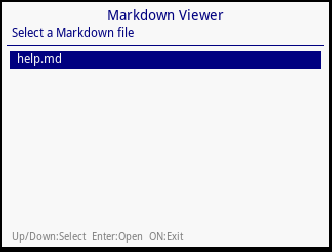
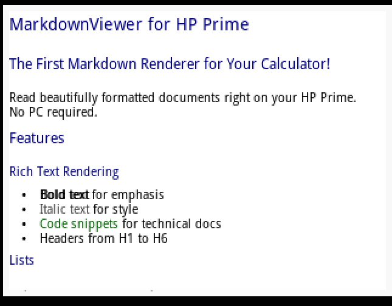
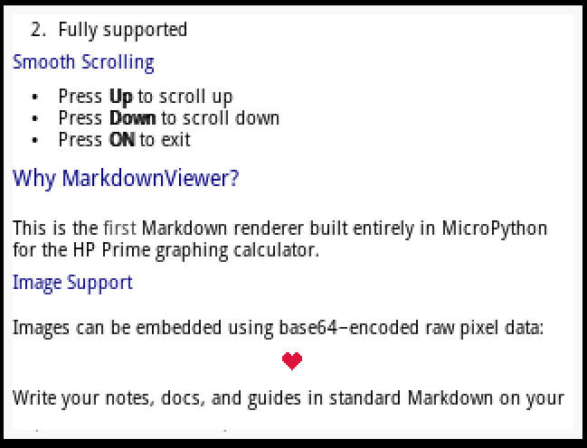
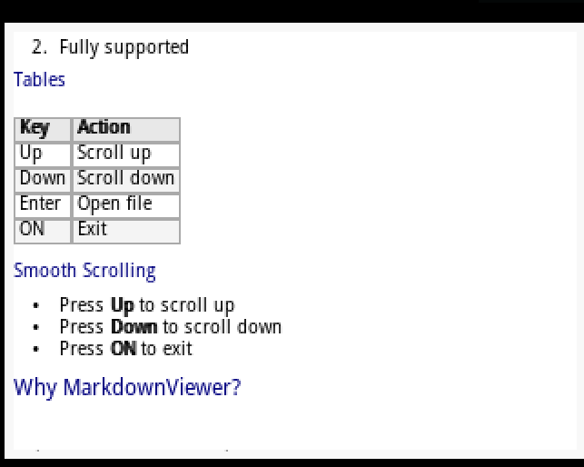

# MarkdownViewer for HP Prime

**The first Markdown renderer built entirely in MicroPython for the HP Prime graphing calculator.**

Read beautifully formatted Markdown documents right on your calculator's 320×240 display — no PC required.

---

## Features

- **Headers** — H1 through H6 with distinct sizing and color
- **Bold**, *italic*, and `inline code` formatting
- **Bullet lists** and **numbered lists**
- **Horizontal rules** (`---`, `***`, `___`)
- **Tables** with header styling and alternating row colors (warns if too wide)
- **Embedded images** via base64-encoded raw pixel data
- **Word wrapping** that fits the 320px-wide screen
- **Smooth scrolling** with Up/Down keys
- **Built-in file browser** to pick `.md` files from calculator storage

## Screenshots






## Getting Started

### Prerequisites

- An **HP Prime** graphing calculator (hardware or virtual/emulator)
- Firmware that supports MicroPython / Python apps

### Installation

1. Connect your HP Prime to your computer.
2. Copy the entire `MarkdownViewer.hpappdir` folder into the calculator's app directory.
3. The app will appear as **MarkdownViewer** in your application list.

### Adding Markdown Files

Place any `.md` files in the app's storage folder on the calculator. The built-in file browser will list them automatically.

### Usage

1. Launch **MarkdownViewer** from the app menu.
2. Use **Up / Down** to highlight a `.md` file, then press **Enter** to open it.
3. Scroll through the rendered document with **Up / Down**.
4. Press **ON** (or trigger a `KeyboardInterrupt`) to return to the file browser or exit.

## Controls

| Key | Action |
|---|---|
| **Up** | Scroll up / previous file |
| **Down** | Scroll down / next file |
| **Enter** | Open selected file |
| **ON** | Exit viewer / app |

## Supported Markdown Syntax

| Element | Syntax |
|---|---|
| Headings | `# H1` through `###### H6` |
| Bold | `**bold**` |
| Italic | `*italic*` |
| Inline code | `` `code` `` |
| Bullet list | `- item` or `* item` |
| Ordered list | `1. item` |
| Horizontal rule | `---`, `***`, or `___` |
| Tables | `\| col1 \| col2 \|` (up to 5 columns) |
| Images | `` |

> **Note:** Images use a custom raw format — the first 4 bytes encode width and height (2 bytes each, big-endian), followed by RGB pixel triplets, all base64-encoded.

## Project Structure

```
MarkdownViewer.hpappdir/
├── main.py              # Entry point — file browser + viewer loop
├── markdown_viewer.py   # MarkdownViewer, MarkdownRenderer & MarkdownDocument classes
├── graphics.py          # Drawing primitives (text, rectangles, images)
├── constants.py         # Colors, font sizes, graphics buffer IDs
├── file_ops.py          # File listing via HP Prime AFiles()
├── keycodes.py          # Key code constants for GETKEY
├── utils.py             # Misc helpers (color math, text measurement)
├── time.py              # Simple tick-based timer
├── help.md              # Sample Markdown file bundled with the app
├── MarkdownViewer.hpapp          # HP Prime app descriptor
├── MarkdownViewer.hpappnote      # App notes
└── MarkdownViewer.hpappprgm      # App program metadata
```

## How It Works

1. **`main.py`** boots the app, scans for `.md` files via `file_ops.list_files()`, and presents a scrollable file browser.
2. When a file is selected, a **`MarkdownViewer`** instance loads and parses the Markdown content.
3. **`MarkdownRenderer`** walks each line, identifies block-level elements (headers, lists, rules, images), then renders them with word-wrapping and inline formatting to the HP Prime's graphics buffer using `TEXTOUT_P` and `FILLRECT` PPL commands exposed through the `hpprime` MicroPython module.
4. Scrolling adjusts a vertical offset and re-renders the visible portion of the document.

## Limitations

- No nested lists or blockquotes
- Tables wider than 5 columns display a warning instead of rendering
- No link rendering (URLs are displayed as plain text)
- Code fences (` ``` `) are recognized but the enclosed block is rendered as plain text
- Images must be in the custom base64-encoded raw RGB format described above

## Contributing

Contributions are welcome! Feel free to open issues or submit pull requests.

Some ideas for future improvements:

- Blockquote support
- Link highlighting
- Larger image support with scrolling
- Theme / color customization

## License

This project is provided as-is for educational and personal use.

## Author

**Andrea Baccin**

---

*Built with ❤️ for the HP Prime community.*
